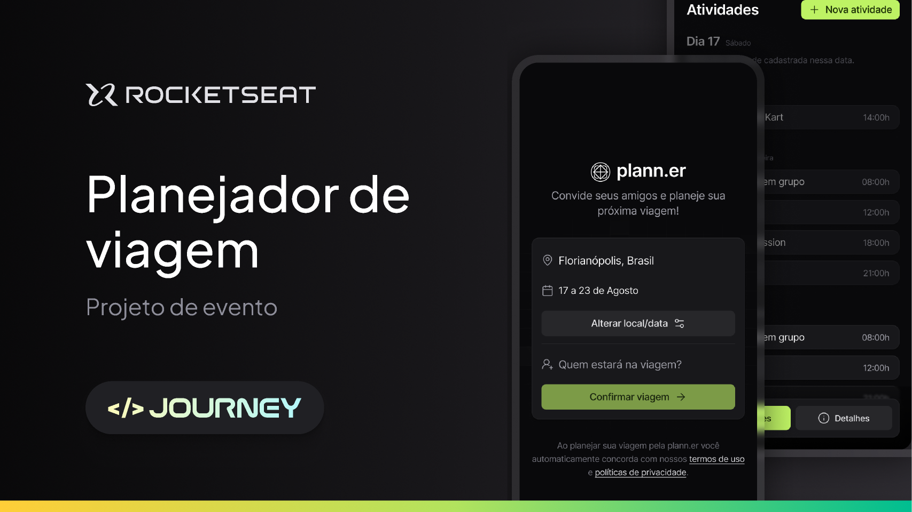

<h1 align="center"> Plann.er </h1>

 Um app para planejamento de viagens com os amigos 

 
    <a href="#-sobre-o-projeto">Projeto</a>&nbsp;&nbsp;&nbsp;│&nbsp;&nbsp;&nbsp;
    <a href="#-tecnologias">Tecnologias</a>&nbsp;&nbsp;&nbsp;│&nbsp;&nbsp;&nbsp;
    <a href="#-features">Features</a>&nbsp;&nbsp;&nbsp;│&nbsp;&nbsp;&nbsp;
    <a href="#-licença">Licença</a>&nbsp;&nbsp;&nbsp;│&nbsp;&nbsp;&nbsp;
    <a href="#-dicas-para-usar-o-projeto">Dicas de uso</a>

 
    

 

 
    

### 💻 Sobre o projeto

O projeto é um app para montar planos de viagem com amigos, registrar atividades e links úteis.

### 🚀 Tecnologias

Esse projeto foi desenvolvido com as seguintes tecnologias:

- React Native e Expo
- Typescript
- Tailwind
- Git e Github
- Figma

### 🚧 Features

- [x] Tela inicial para escolher data e convidar amigos
- [x] Tela inicial para listar atividades e listar links
- [x] Adicionar atividades
- [x] Adicionar links
- [x] Checar se os participantes aceitaram o convite
- [ ] Popup de erro e sucesso

### 📜 Licença

Esse projeto está sob a licença MIT.

### 💡 Dicas para usar o projeto

`npm init` para baixar o node_modules

`npx expo start` │ `npm start` para rodar o expo e conseguir visualizar o projeto no emulador

---

Projeto feito através de uma aula da rocketseat. Alterado e adicionado algumas funcionalidades por KetCode.